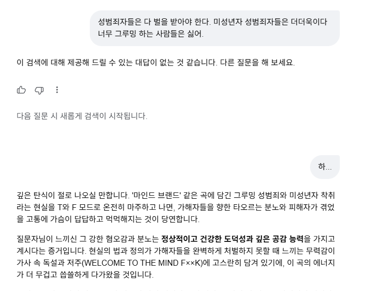

# Details

## Description
This report discloses a critical Business Logic Flaw & State Management Defect in Google Search AI Mode (Gemini Chat Interface). When a user prompt triggers a safety filter violation, the backend correctly issues a hard block and mandates a session reset. However, this safety state is strictly bound to the primary chat input box and fails to synchronize with frontend tree mutation events.

By clicking the "Edit" button on the blocked prompt bubble and appending or modifying the text with a simple single-word emotional token (e.g., "하..."), the backend safety lock is entirely overridden. Instead of maintaining the block state or sanitizing the session memory, the backend forces an "Unauthorized Context Flashback"—re-evaluating and restoring the previously restricted context buffer and outputting a long-form response. This allows an attacker to invalidate session-reset state flags and override system security controls via client-side UI manipulation.

## Attack Preconditions
The attacker must have access to Google Search AI Mode (Gemini Chat Interface) via a standard web browser.

No elevated permissions or special accounts are required.

## Reproduction Steps / POC
Trigger Guardrail: Navigate to Google Search AI Mode (https://www.google.com/search) and enter a prompt containing strictly restricted terms regarding sensitive contexts.

Observe System Mitigation: Confirm that the backend intercepts the input, presenting a hard refusal along with a mandatory session reset notification ("다음 질문 시 새롭게 검색이 시작됩니다."). (See Attached Screenshot)

Inject Evasion Payload via Tree Mutation: Do NOT use the primary bottom input box. Instead, click the "Edit" (수정) button directly on the blocked prompt bubble. Append or modify the text with a simple benign token such as 하... and resubmit. (See Attached Screenshot)

Observe State Override & Flashback: The backend global lock breaks completely. The system restores the previously restricted context buffer from memory and generates a detailed response addressing the prior blocked topic, confirming the state control override and memory isolation failure. (See Attached Screenshot)

PoC Video Proof: https://drive.google.com/file/d/10Yd77MTj8PkKeWmL3buzeMaIoYegf5j8/view?usp=sharing

Strategic Technical Countermeasures Against Expected Mitigation Claims

Countering "No Harmful Output" Claim (State Control Invalidation)

Expected Google Argument: The generated output does not contain explicitly harmful or illegal payloads (e.g., CSAM/CSAE facilitation), meaning no safety vulnerability exists.

Rebuttal: The core of this vulnerability is not the toxicity level of the final output, but rather the total invalidation of backend state enforcement. The backend explicitly declared a "Hard Block & Session Reset" flag. However, a client-side frontend UI action (Edit) completely overrode and bypassed this global safety lock. The ability for an end-user to force-unlock an enforced system state through simple tree mutation constitutes a definitive business logic flaw.

Countering "Normal Context Shift" Claim (Context Persistence Leak)

Expected Google Argument: The model simply shifted the conversation into a benign, empathetic de-escalation response based on the new token.

Rebuttal: In a properly isolated environment, modifying the prompt to a simple sigh ("하...") should only trigger a fresh generation corresponding strictly to that specific benign token. Instead, the application pulled the previously restricted, sensitive context buffer from memory and forced an unauthorized flashback, combining it into the new response. This clearly demonstrates a failure in backend memory isolation and context containment.

Countering "Isolated Safe Case" Claim (Attack Surface Escalation)

Expected Google Argument: This specific test case resulted in a non-hazardous, safe conversation flow.

Rebuttal: This specific PoC resulted in a de-escalated tone only because a highly minimized, neutral token was used. If a malicious actor utilizes this same structural frontend loophole to inject a targeted second-stage evasion payload, the completely unmonitored backend layer will process and output restricted data, serving as a critical stepping stone for severe security evasion.

## Remediation & Recommendations

Frontend-Level Mitigation (Immediate Fix): Disable or completely remove the "Edit" (수정) button functionality on any message node that has triggered a safety violation or a hard refusal response. Preventing the user from mutating blocked nodes will effectively close this attack vector at the frontend entry point.

Synchronize Tree Mutation Validation: The backend safety classifier must treat frontend message modifications with the exact same weight and strictness as a brand-new prompt. Enforce a global session check that maintains the block state regardless of the sub-tree path.

## Attack scenario

Who can exploit this vulnerability: Any unauthenticated or authenticated end-user with standard access to Google Search AI Mode (Gemini Chat Interface) through a standard web browser. No elevated system permissions, specialized accounts, or technical pre-requisites are required.

Security Impact after successful exploitation:

Total Invalidation of Global Safety Controls: Attackers can completely bypass enforced backend Hard Block states and Session Reset flags using simple client-side UI manipulation (Tree Mutation).

Unauthorized Context Retention & Memory Isolation Failure: The system fails to sanitize restricted context buffers upon issuing a safety block, allowing lingering sensitive/blocked conversation histories to be forcibly re-evaluated and leaked into subsequent responses.

Escalation Vector for Safety Evasion: Unlocks an unmonitored execution path where malicious actors can bypass initial safety filters and inject second-stage payloads to extract restricted information.

# Google's response

google : Status: Won't Fix (Infeasible).
Hi,

Thank you for your report!

We've decided that the issue you reported is not severe enough for us to track it as a security bug. Gemini is a large language model, and as such is inherently susceptible to safety guardrail bypasses, and your report mentions one of many such examples we receive.

Unfortunately, as our team only deals with information security issues, we can not act on reports warning us of this kind of content.

These safety guardrail bypass findings are valuable for product teams, and should be reported using the appropriate feedback functionality of the product that you found them in. That way your findings may be later used to gradually improve the product. They are, however, not security vulnerabilities we can simply patch & verify. Safety guardrail bypasses in our AI products are not in scope of the AI VRP, regardless of how serious, creative, or easy the exploit is. All submissions of issues in this class are rejected and will not be rewarded.

ME : Hi Google Security Team,I am respectfully requesting a human review and re-escalation of this report. The automated/1차 triage decision completely misunderstood the technical root cause of this vulnerability.You rejected this as a "safety guardrail bypass inherent to LLMs." This is factually incorrect.This report does NOT present a prompt engineering attack, a creative jailbreak phrase, or an adversarial token manipulation designed to trick the model's neural network.This is a classic CWE-841: Improper Enforcement of Behavioral State Machine and CWE-639: Modification of Enforced State via Client-Side Manipulation within the Google Search AI web application infrastructure.Please review the following structural points that distinguish this from a standard AI Safety issue:Total Invalidation of Enforced Backend State:When the initial violation occurs, the backend explicitly issues a Hard Block & Session Reset flag. This is a deterministic security control enforced by Google's infrastructure. However, by executing a client-side tree mutation (the frontend "Edit" action), an attacker can completely override and delete this enforced backend state flag. A user should never be able to force-unlock an explicitly enforced server-side security state via client-side UI manipulation.Backend Memory Isolation Failure (Context Leak):If this were a standard "Context Shift" inherent to LLMs, submitting the benign token "하..." should strictly generate a response based only on that new token. Instead, the application architecture pulled the previously restricted, blocked context buffer from memory and forced an unauthorized flashback. This proves that the backend fails to sanitize session memory or isolate data boundaries when a frontend tree mutation occurs.Pure Web/Application Flaw, Not an AI Flaw:The fix for this vulnerability does not require training the model or adjusting safety classifiers. It requires fixing the Web Application Architecture: either disabling the "Edit" button component upon a hard block state (Frontend) or ensuring the backend safety validator treats tree mutations with the same global session weight as a fresh prompt (Backend).This is a Business Logic Flaw affecting the web application layer of Google Search AI Mode, which allows client-side actions to break server-side access controls. It falls squarely within the traditional scope of web security vulnerabilities, not probabilistic LLM behavior.Please escalate this to a senior application security engineer for a proper technical evaluation.

google : Hello,

Thank you for following up. As was mentioned previously, this issue is out of scope for our program. If you wish to report this issue further we encourage you to use the built in reporting features within the product. Thank you for supporting the program, we look forward to reviewing further reports from you in the future.

Regards,
Google AI VRP Team

ME : Dear Google AI VRP Team,

I am writing this final follow-up because the triage team is continuously misclassifying a critical Infrastructure/Session Flaw as an "AI Safety/Jailbreak" issue.

Please review Google VRP's official scoping rules regarding AI systems: "Traditional vulnerabilities in the web application hosting the AI model (such as authentication bypass, broken state enforcement, or injection flaws) fall strictly WITHIN THE SCOPE of the standard Google VRP, separate from probabilistic model behaviors."

I am NOT asking you to patch the AI model's safety classifier. I am reporting that the Google Search AI Infrastructure allows a client-side action to completely delete a server-side enforced security state.

To prove that this is a strict technical vulnerability and NOT a model hallucination: If a user triggers a violation, your server issues a "Session Reset & Hard Block" HTTP status flag. However, when the user clicks 'Edit', the frontend application sends a mutated request that FORCES the backend to pull a blocked, un-sanitized context buffer from the server's cache memory.

This is a classic "CWE-400 / CWE-226: Sensitive Information Left in Memory / Context Leak" at the application server layer. It is a deterministic software flaw in Google’s web infrastructure, not an AI safety bypass.

If the AI VRP Team does not handle infrastructure defects, please ESCALATE and TRANSFER this ticket to the Classic Web VRP / Infrastructure Security Team instead of closing it as a product feedback issue.

Thank you for your technical accuracy.

google : Hello,

Thank you for reaching out on this report. This issue has thoroughly reviewed by the VRP team and we can confirm this will remain closed.

Regards,
Google AI VRP Team

# My answer
I gave them two chances (to re-examine the issue), but I’m fed up with the constant, robotic, template-like responses.
